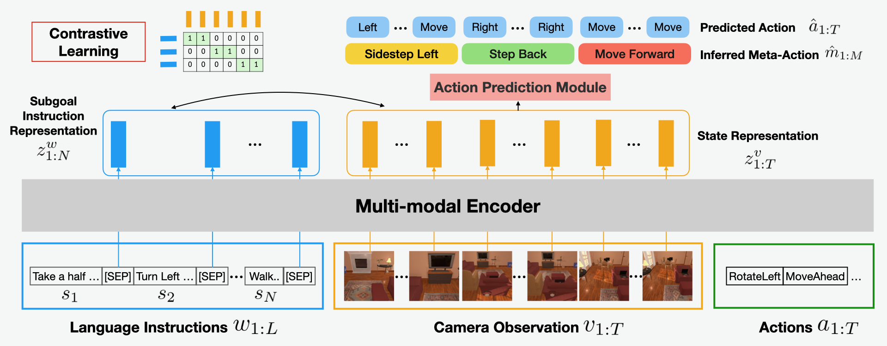

# LACMA (Language-Aligning Contrastive Learning with Meta-Actions for Embodied Instruction Following)

This is the code base to reproduce:
[<b>LACMA: Language-Aligning Contrastive Learning with Meta-Actions for Embodied Instruction Following</b>](https://arxiv.org/abs/2310.12344) (EMNLP 2023)

[Cheng-Fu Yang](https://joeyy5588.github.io/chengfu-yang/), Yen-Chun Chen, Jianwei Yang, Xiyang Dai, Lu Yuan, Yu-Chiang Frank Wang, Kai-Wei Chang



## Installation

Clone repo:
```bash
$ git clone https://github.com/joeyy5588/LACMA.git LACMA
$ export LACMA_ROOT=$(pwd)/LACMA
$ export LACMA_LOGS=$LACMA_ROOT/logs
$ export LACMA_DATA=$LACMA_ROOT/data
$ export PYTHONPATH=$PYTHONPATH:$LACMA_ROOT
```

Install requirements:
```bash
$ conda create -n lacma_env python=3.7
$ conda activate lacma_env
$ cd $LACMA_ROOT
$ pip install --upgrade pip
$ pip install -r requirements.txt
```

Running on remote headless server: 
```bash
$ tmux
$ sudo python scripts/startx.py 0
$ export DISPLAY=:0
```

## Preparing data

Download [ALFRED dataset](https://github.com/askforalfred/alfred):
```bash
$ cd $LACMA_DATA
$ sh download_data.sh json_feat
```

Download the pretrained detection model from [google drive](https://drive.google.com/file/d/1lXEIX3cM6iVanRiVGYM_E46pJM71bkFQ/view?usp=drive_link) or using `gdown`:
```bash
$ gdown 1lXEIX3cM6iVanRiVGYM_E46pJM71bkFQ
$ mkdir $LACMA_LOGS/pretrained
$ unzip pretrained.zip -d $LACMA_LOGS/pretrained
```

Rollout the trajectories to get the field of view (FOV) images or download it from [here](https://acvrpublicycchen.blob.core.windows.net/lacma/data.tar):
```bash
# Manually rollout the trajectories
$ python -m alfred.gen.render_trajs

# Or download the rollout images
$ wget https://acvrpublicycchen.blob.core.windows.net/lacma/data.tar
$ tar -xvf data.tar -C $LACMA_DATA
```

Create an LMDB dataset with natural language annotations:
```bash
$ python -m alfred.data.create_lmdb with args.visual_checkpoint=$LACMA_LOGS/pretrained/fasterrcnn_model.pth args.data_output=lmdb_human args.vocab_path=$LACMA_ROOT/files/human.vocab
```
Note #1: For rendering, you may need to set `args.x_display` to `DISPLAY` correspond to an X server number running on your machine.  
Note #2: We do not use JPG images from the `full` dataset as they would differ from the images rendered during evaluation due to the JPG compression.  

Parse meta-actions from low-level action sequences (***Algorithm 1*** and ***Algorithm 2*** in paper).
```bash
$ python scripts/meta_action.py [data_split] # train/valid_seen/valid_unseen
$ python scripts/write_vocab.py
```
## Pretrained models evaluation

Evaluate LACMA on ALFRED dataset:
```bash
$ python -m alfred.eval.eval_agent with eval.exp=pretrained eval.checkpoint=p$LACMA_LOGS/pretrained/lacma_pretrained.pth eval.object_predictor=$LACMA_LOGS/pretrained/maskrcnn_model.pth exp.num_workers=5 eval.eval_range=None eval.split=valid_seen exp.data.valid=lmdb_human
```

Note: make sure that your LMDB database is called exactly `lmdb_human` as the word embedding won't be loaded otherwise.

Note: For evaluation, you may need to configure `eval.x_display` to correspond to an X server number running on your machine.

## Language pretraining

Language encoder pretraining with the translation objective:
```bash
$ python -m alfred.model.train with exp.model=speaker exp.name=translator exp.data.train=lmdb_human
```

Note: you may need to train up to 5 agents using different random seeds to reproduce the results of the paper.

## Meta-action contrastive pretraining 

```bash
$ python -m alfred.model.train with exp.model=newmeta exp.name=meta_pretrain exp.data.train=lmdb_human train.seed=42 exp.pretrained_path=logs/translator/model_19.pth
```

## Finetuning with low-level actions
```bash
$ python -m alfred.model.train with exp.model=newmeta exp.name=meta_finetune exp.data.train=lmdb_human train.seed=42 exp.pretrained_path=logs/meta_pretrain/model_19.pth
```

When finetuning, comment out `L281, L290` and uncomment `L272` in `alfred/model/newmeta.py`

Evaluate the trained LACMA agent: 
```bash
$ python -m alfred.eval.eval_agent with eval.exp=meta_finetune eval.object_predictor=$LACMA_LOGS/pretrained/maskrcnn_model.pth exp.num_workers=5 eval.eval_range=None eval.split=valid_seen 
```
## Acknowledgements

This project heavily borrows from [Episodic Transformer](https://github.com/alexpashevich/E.T.) by [Alexander Pashevich](https://thoth.inrialpes.fr/people/apashevi/). Huge thanks to them for their work!


## Citation

If you find this repository useful, please cite our work:
```bibtex
@inproceedings{yang2023lacma,
  title = {LACMA: Language-Aligning Contrastive Learning with Meta-Actions for Embodied Instruction Following},
  author = {Yang, Cheng-Fu and Chen, Yen-Chun and Yang, Jianwei and Dai, Xiyang and Yuan, Lu and Wang, Yu-Chiang Frank and Chang, Kai-Wei},
  booktitle = {EMNLP},
  year = {2023}
}
```
